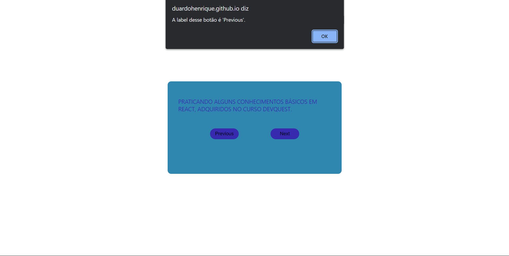
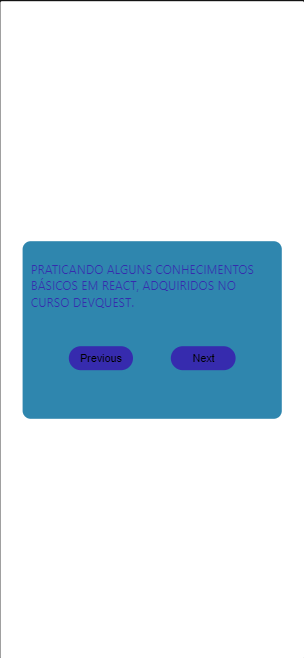

# React Color Enlarge

## Testado com Responsive Viewer :

### Visualização em desktop

### Visualização em dispositivos móveis

## Linguagens utilizadas

- HTML
- CSS
- JavaScript / React

## Comentarios

Projeto proposto pelo curso DevQuest, afim de praticar alguns conhecimentos básicos em React. 